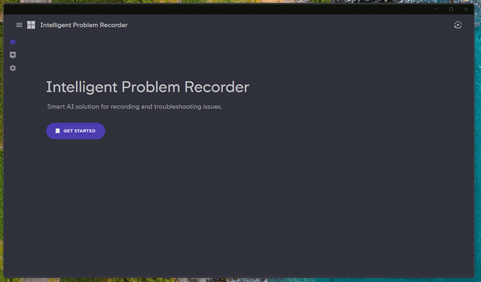

# 🧠 Intelligent Problem Recorder

**AI-Powered Problem Reproduction and Data Collection Assistant for Faster, Smarter Technical Support**

---

## 🚀 Overview

Support cases typically follow four key stages:  
➡️ **Problem Definition** → 🗂️ **Data Collection** → 🛠️ **Solution Development** → ✅ **Solution Validation**

Among these, **Scoping** and **Data Collection** are the foundation of an effective resolution process. Yet, in many real-world support scenarios, these steps are rushed or inadequately documented—limiting the engineer's ability to prepare and research ahead of time.

The **Intelligent Problem Recorder (IPR)** addresses this challenge by combining step recording, image analysis, and AI-based insights to assist both customers and support engineers in the early stages of issue resolution.

---

## 🎯 Problem Statement

Support engineers often receive minimal details when cases are logged. Many users prefer to describe the problem verbally during meetings rather than thoroughly documenting it. This lack of upfront detail restricts engineers from conducting proactive research, ultimately increasing case resolution time.

---

## 💡 Solution

This tool enhances traditional [problem step recording](https://support.microsoft.com/en-us/windows/steps-recorder-deprecation-a64888d7-8482-4965-8ce3-25fb004e975f) by integrating AI-powered analysis and intelligent data recommendations. The **Intelligent Problem Recorder** enables users to document issues clearly, receive contextual suggestions for scoping, and package relevant data into a single report for support teams.

---

## 🔍 How It Works

1. **Customer Encounters an Issue**  
   While logging a case, the customer is prompted to use the IPR tool to capture the issue steps.

2. **Record & Refine**  
   The user records the problem reproduction steps and removes any unnecessary actions.

3. **AI-Powered Analysis**  
   On clicking "Analyze", the tool:
   - Detects the nature of the issue using image and step analysis  
   - Suggests **common scoping questions**  
   - Recommends **additional data collection** steps  
   - Provides simple self-help suggestions where applicable

4. **Generate Package**  
   A single, zipped package is generated containing:
   - Step-by-step trace of the issue
   - Any supplementary files or logs
   - An auto-generated summary of the problem

5. **Support Engineer Review**  
   With access to this structured input, the engineer can quickly understand the context, perform pre-analysis, and begin deeper investigation—**saving an estimated 20% of case lifecycle effort**.

---

## 📦 Features

- ✅ Step-by-step issue reproduction with screenshots  
- 🤖 AI-based image and step analysis (needs model that supports image modality) 
- 💬 Contextual scoping questions and data suggestions  
- 🧾 Auto-generated case summaries  
- 📁 One-click packaging of all relevant information

---

## 🔮 Future Scope

- 📱 **Multi-device data collection** for complex client-server issues  
- 🧠 **Integration with on-device LLMs** to enhance real-time suggestions  
- 🧪 **Pilot testing with support teams** to gather feedback and iterate  
- 🌐 **Expanding AI models** to cover a broader range of technical issues

---

## 📈 Impact

The **Intelligent Problem Recorder** streamlines case creation and investigation by ensuring engineers receive well-scoped, data-rich case submissions—leading to faster issue resolution, reduced back-and-forth communication, and improved customer satisfaction.

---

