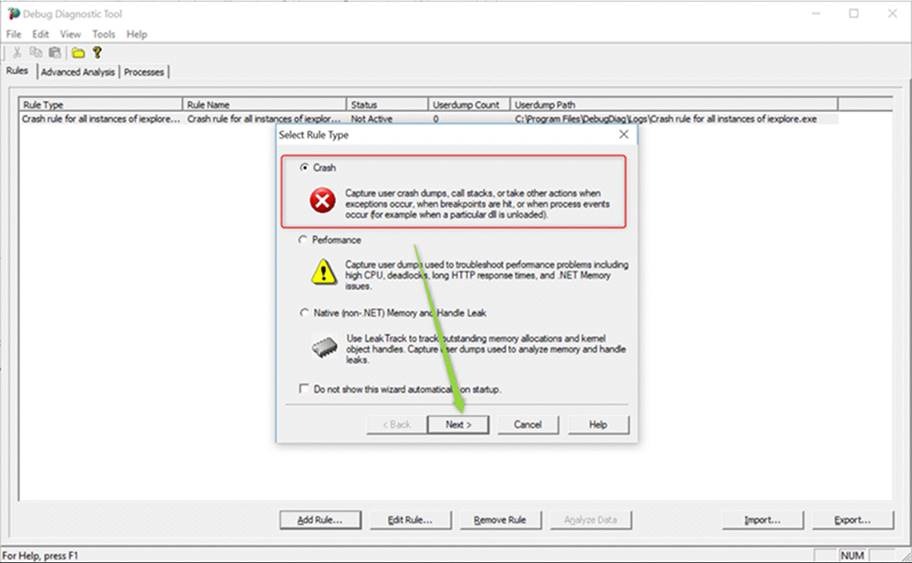
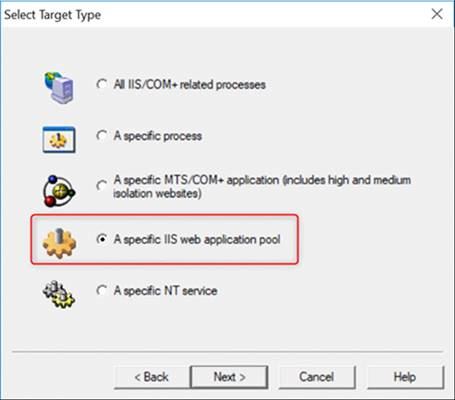
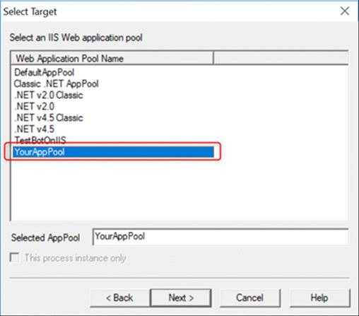
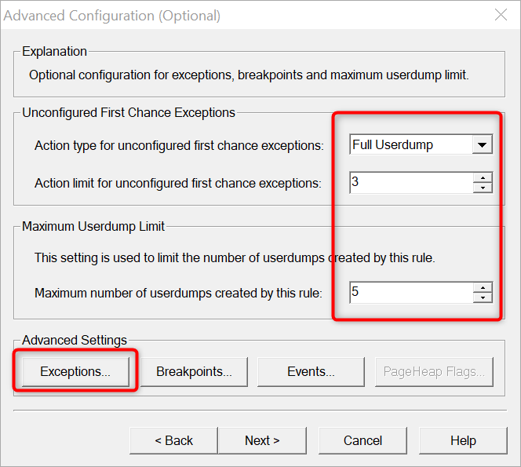
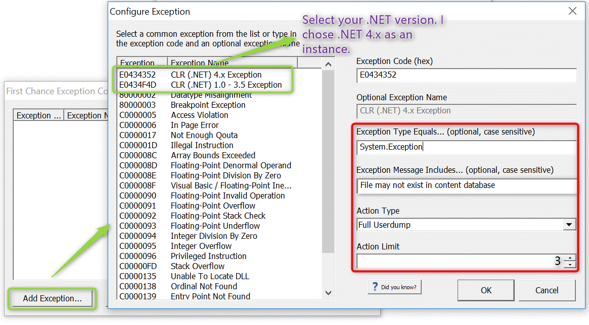
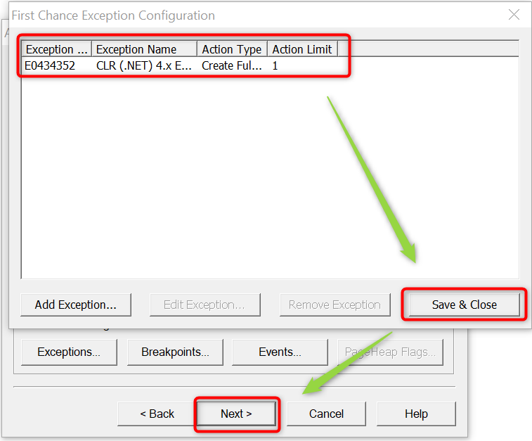
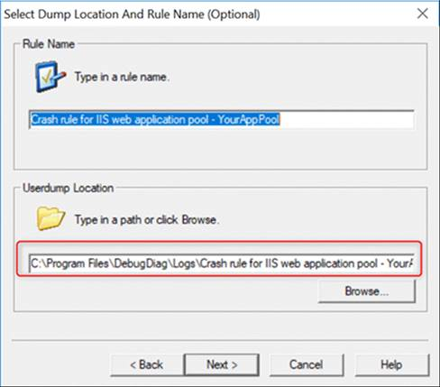
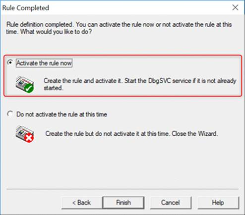
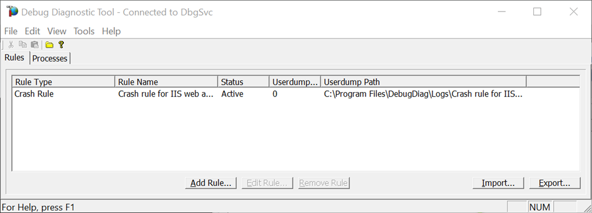

# Capture specific exception by debugdiag
1. Download and install [DebugDiag](https://www.microsoft.com/en-us/download/details.aspx?id=103453) 

1. Search and Open **DebugDiag.Collection.exe** as Administrator.

    
    
1. Add a Crash Rule

    

    

    

    

    

    

    

    

    

1. Check if any dump files generated in the Userdump path after you see the exception again.
