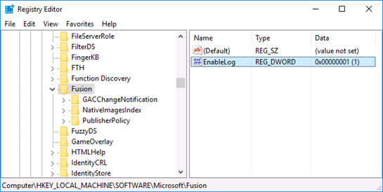
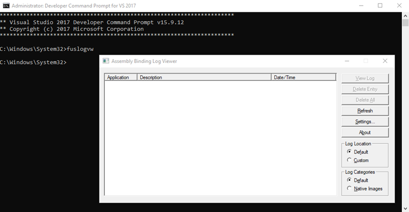

Enable Fusion Logs (Assembly Binding Logging)
---------------------------------------------

Enable Fusion Logs so that you can see where the binding is failing. There are two ways to enable it:

1.  Registry Editor
2.  Fusion Log Viewer (fuslogvw.exe)

#### Registry Editor:

1.  Open Registry Editor
2.  Go to `HKEY_LOCAL_MACHINE\SOFTWARE\Microsoft\Fusion`
3.  Change the value of `EnableLog` to `1`. If this key doesn't exist, create it (`DWORD(32-bit)` type)

     

Other related registry keys:

```
DWORD ForceLog set value to 1
DWORD LogFailures set value to 1
DWORD LogResourceBinds set value to 1
String LogPath set value to folder for logs (Example: C:\FusionLog\)
```

#### Fusion Log Viewer (fuslogvw.exe)

You can also use Microsoft's Fusion Log Viewer utility ([Reference](https://docs.microsoft.com/en-us/dotnet/framework/tools/fuslogvw-exe-assembly-binding-log-viewer)) to enable Fusion Logs. Fusion Log Viewer is installed with Visual Studio. It should be in your "Microsoft SDKs" folder (Example path: `C:\Program Files (x86)\Microsoft SDKs\Windows\v{SDK version}A\Bin\FUSLOGVW.exe`).

You can also run it by using Visual Studio Command Prompt (Run the command prompt as Administrator):



Steps to enable assembly binding via Fusion Log Viewer:

1.  Click fuslogvw.exe or run it using Visual Studio Command Prompt
2.  Click "**Settings**"
3.  Select "**Log bind failures to disk**"
4.  Check "**Enable custom log path**"
5.  Create the directory you want the logs to be recorded in (Example: C:\FusionLogs)
6.  Enter the path of this folder in "**Custom log path**" field
7.  Click "**OK**"

After enabling it, reproduce the issue. Then click "**Refresh**" in the Fusion Log Viewer. You should see the binding failure listed. Click "**View log**" to see more information.

Disable assembly binding logging once you complete troubleshooting because it may affect your server's performance.