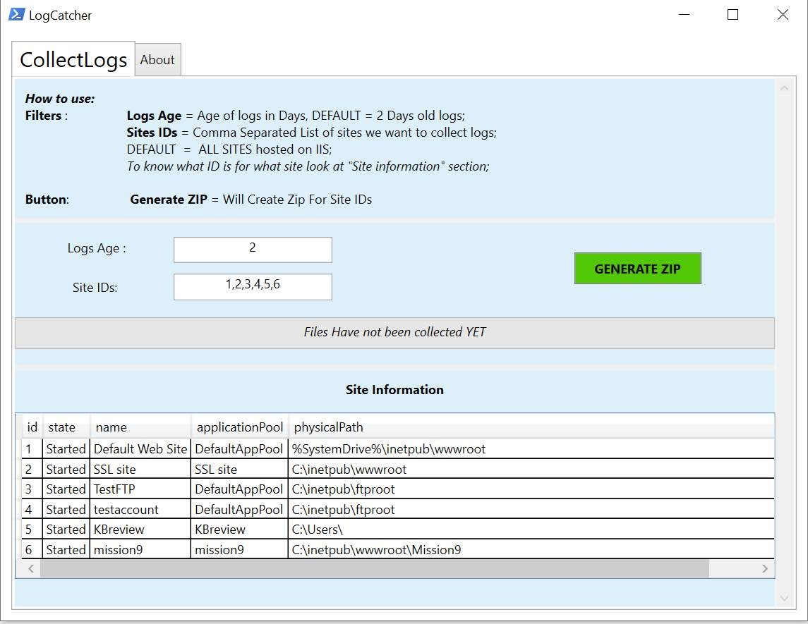
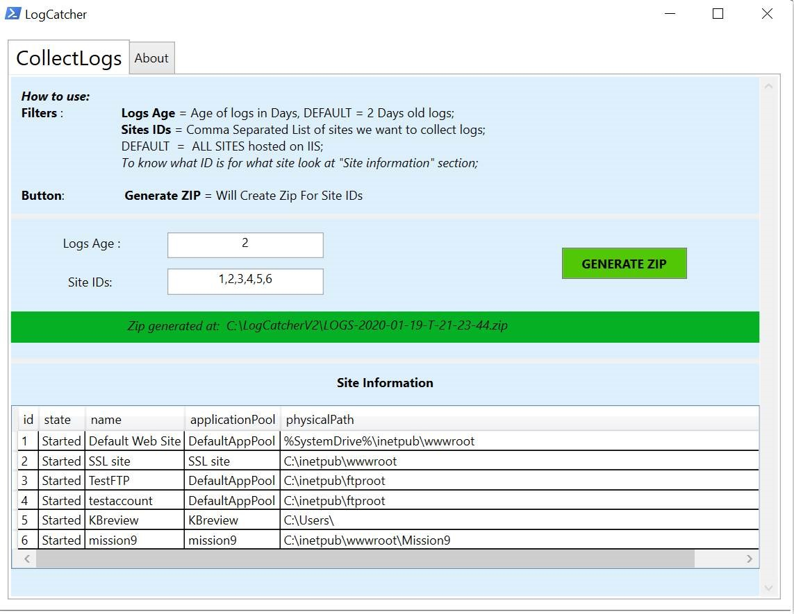
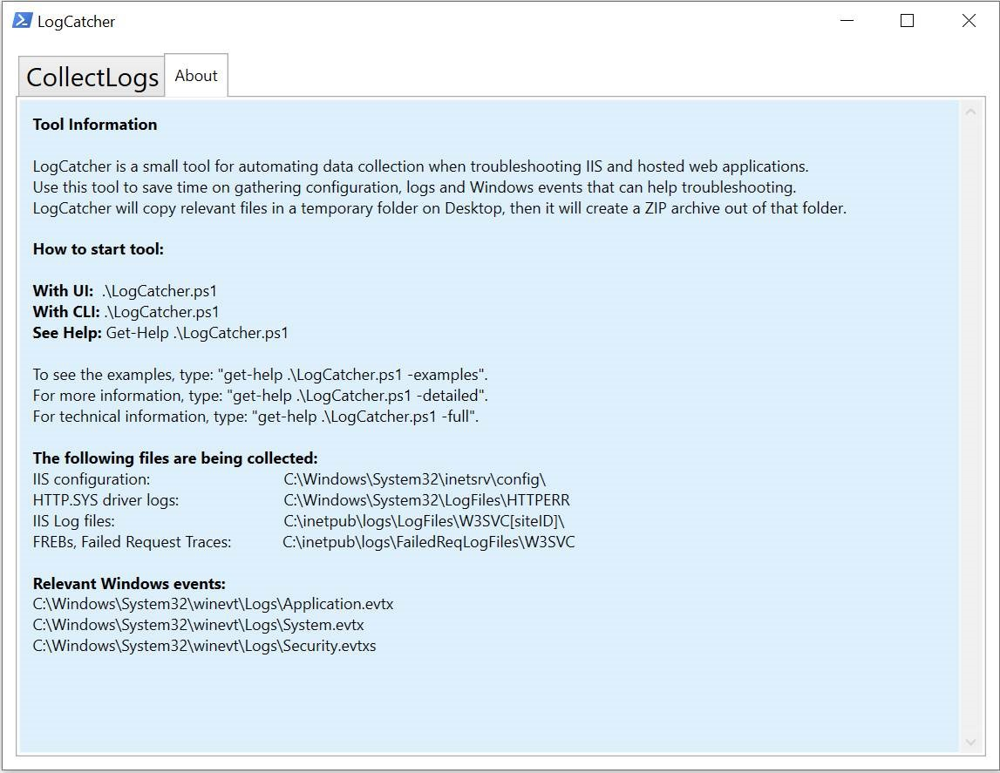

####
When you first launch the tool, you will see a screen with a brief description of how to use the tool and what each of the buttons does. At the bottom you can see a list of the sites that are hosted on the server, their corresponding application pools and the content location. 

If you want to filter-down the amount of data collected from your system, you can choose  for how many days to collect data, and for which sites to collect data by specifying the site ID. We wanted to add this feature so that we are completely transparent about  the amount of data collected from your system.

 
 
 
Once you are done with the filtering you can press the __GENERATE ZIP__ button and begin the log collection.  The status bar will let you know once everything is collected and packaged up into a zip file and where you can find the zip file.
 
  
 
File Explorer will open automatically the folder where the logs .zip file is saved.
The tool also has an About tab where you can find more details about how you can use the tool and which files are collected from your system.
We collect the following:
The IIS configuration files located in C:\WINDOWS\system32\inetsrv\config
The HTTP.sys logs located in C:\Windows\System32\LogFiles\HTTPERR
The System, Application, Security, Setup, Microsoft-IIS-Configuration and CAPI2 Event logs,
The IIS log files for the sites which you selected
The Failed Request traces for the sites which you selected

__LogCatcher doesn't automatically upload the files to the Microsoft servers because we didn't want anyone to think that this tool collects data without your knowledge and approval. You can take a look at the zip archive generated by the tool and see exactly what data is collected and then choose to upload it to Microsoft for analysis.__

 
  
 
  If you need to collect logs from multiple servers and you don't want to click through each time or if you simply like doing everything from the command line you can also run the tool from the PowerShell command-line, without any UI. You can get more information about how to do this by be running the __Get-Help__ command. Below I have added some examples of how to run the tool from the PowerShell CLI, and what parameters you can use:

   
    -------------------------- EXAMPLE 1 --------------------------
 
    PS C:\>To start Tool using CLI with Defaults prop
 
    .\LogCatcher.ps1 -Quiet $true 

    PS C:\>To start Tool with UI
 
    .\LogCatcher.ps1 
 
 
    -------------------------- EXAMPLE 2 --------------------------
 
    PS C:\>To start Tool with CLI and custom ZIP location
 
    .\LogCatcher.ps1 -Quiet $true -ZipLocation "C:\Temp"
 
 
 
 
    -------------------------- EXAMPLE 3 --------------------------
 
    PS C:\>To change AGE of logs and Sites that are collected:
 
    .\LogCatcher.ps1 -Quiet $true -LogAge 45 -SiteIds "1,2,3,4"
 
 
 
 
    -------------------------- EXAMPLE 4 --------------------------
 
    PS C:\>Example showing all Param options:
 
    .\LogCatcher.ps1 -Quiet $true -LogAge 45 -SiteIds "1,2,3,4" -ZipLocation "C:\Temp"
 
 

 
