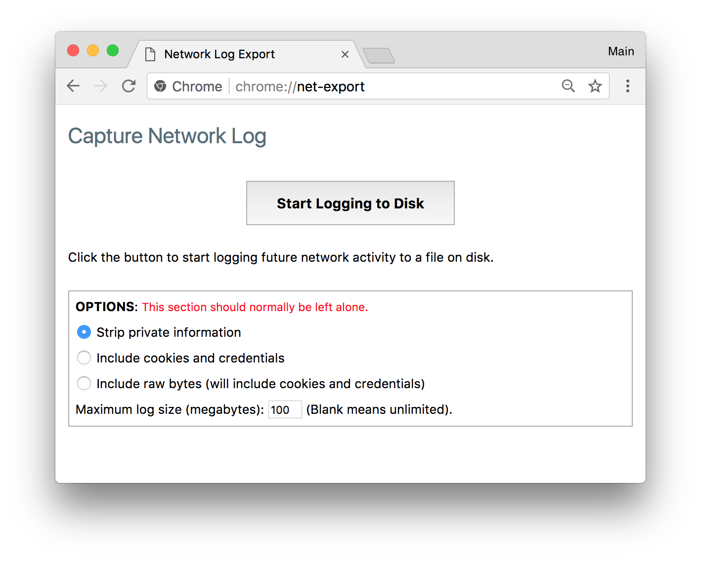

How to capture a NetLog dump
============================

A *NetLog dump* is a log file of the browser's network-level events and state. You may be asked to provide this log when experiencing page load or performance problems.

To create a *NetLog dump*, open a new tab and navigate to:

> chrome://net-export/

You can then follow the instructions on that page.

**Step-by-step guide**

1.  Open a new tab and go to `chrome://net-export/`
2.  Click the **Start Logging To Disk** button.
3.  Reproduce the network problem **in a different tab** (the chrome://net-export/ tab needs to stay open or logging will automatically stop.)
4.  Click **Stop Logging** button.
5.  Provide the resulting log file for investigation.
    -   Provide the **entire** log file. Snippets are rarely sufficient to diagnose problems.
    -   **Include any relevant URLs or details to focus on.**